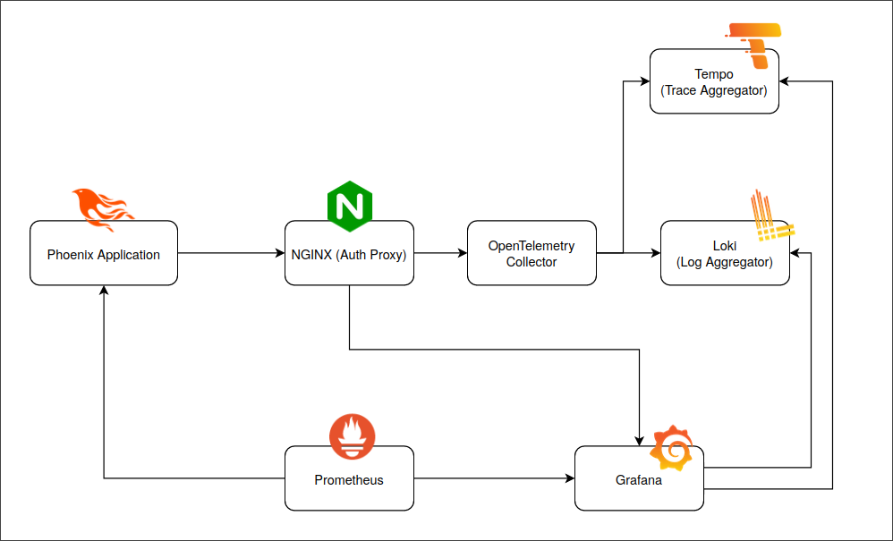
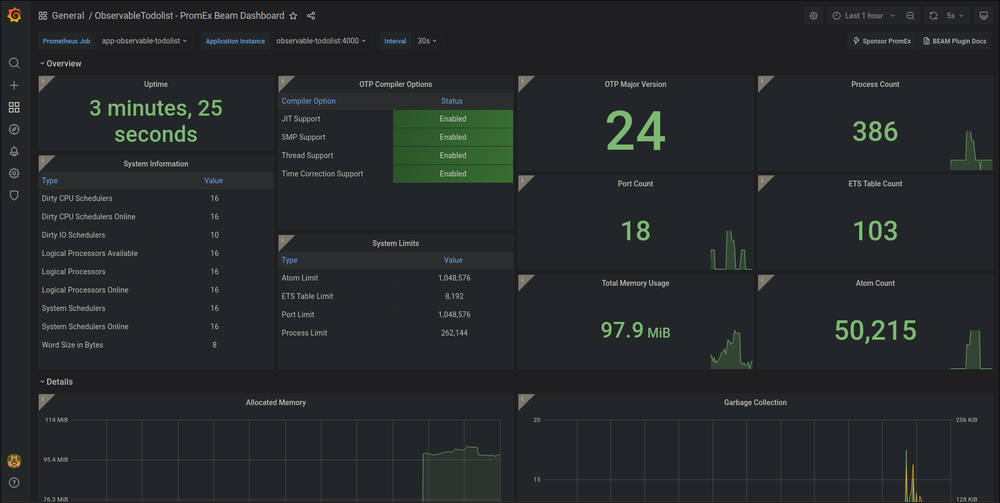
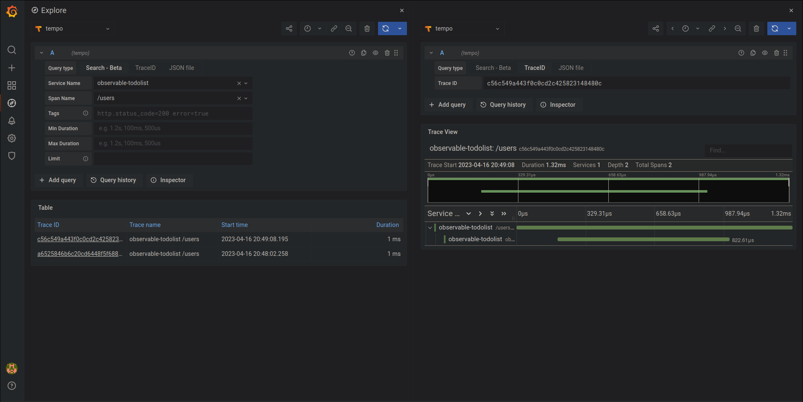
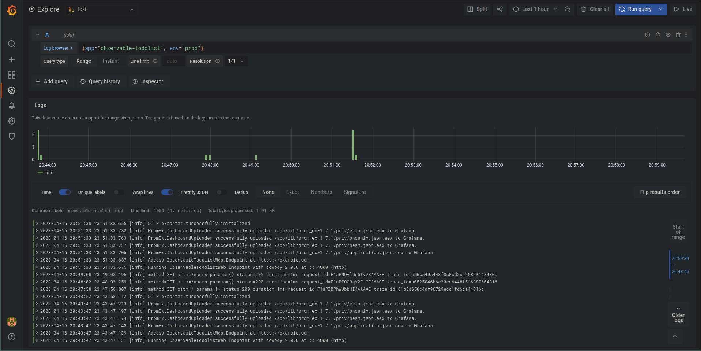

# Observable TODO List

This project showcases an observable Phoenix application using:

- [Loki](https://grafana.com/oss/loki/) for logs
- [PromEx](https://github.com/akoutmos/prom_ex) and [Prometheus](https://prometheus.io/) for metrics
- [OpenTelemetry](https://opentelemetry.io/docs/instrumentation/erlang/) and [Tempo](https://grafana.com/oss/tempo/) for traces
- [Grafana](https://grafana.com/) for data visualization and querying
- An optional NGINX proxy for securing access to the [OpenTelemetry Collector](https://opentelemetry.io/docs/collector/)

It aims to provide a solid start point for adding observability to an
existing/new Phoenix application.

# Architecture


# Trying it out

## Up and Running

This project uses Docker containers and docker-compose to setup its environment,
so if you want to try it, make sure you have
[Docker](https://docs.docker.com/engine/install/) and
[docker-compose](https://docs.docker.com/compose/install/) installed.

In order to see/interact with the application and the generated metrics, run the
following command:

```sh
docker-compose up
```

If everything went well, you should now have everything running locally in your
machine.

## Interacting with the application

Head to http://localhost:4001/users and do some operations: create, show, list
users, etc...

## Checking Grafana

After doing some operations, check Grafana at http://localhost:3000 (default
credentials are **admin:admin**)

### Dashboards

You will find the dashboards generated by PromEx showing metrics on different
subjects, such as the BEAM, Phoenix Endpoints or Ecto repositories:



### Exploring

You can also go to the **Explore** tab and query for specific logs or traces:




